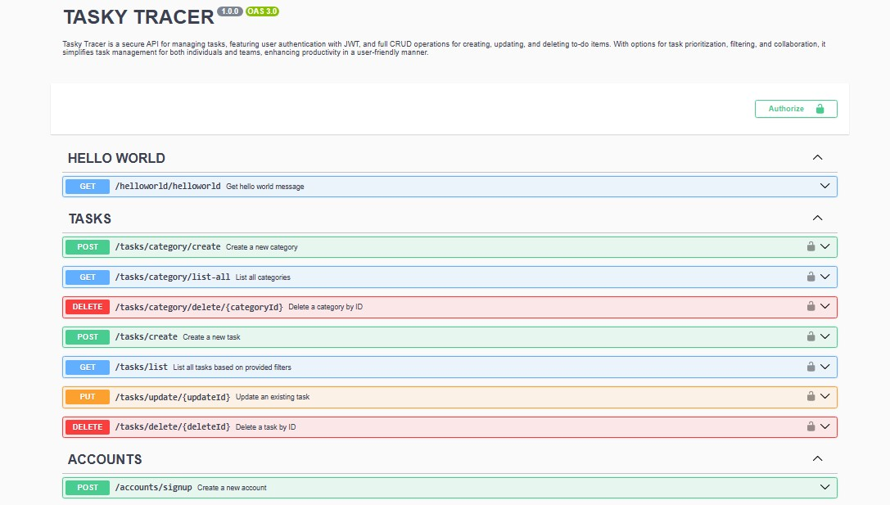
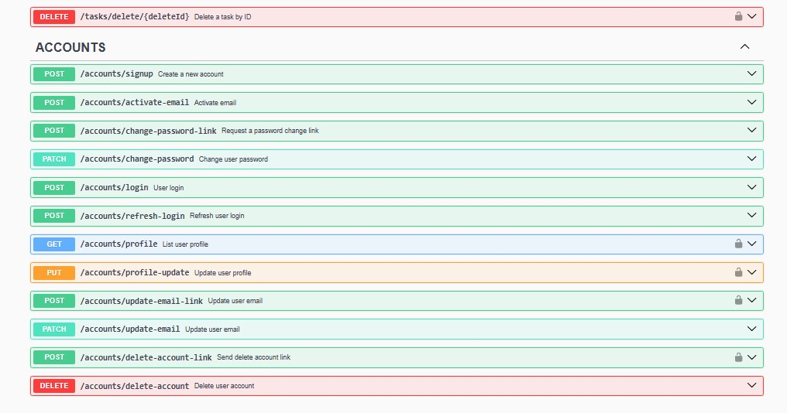
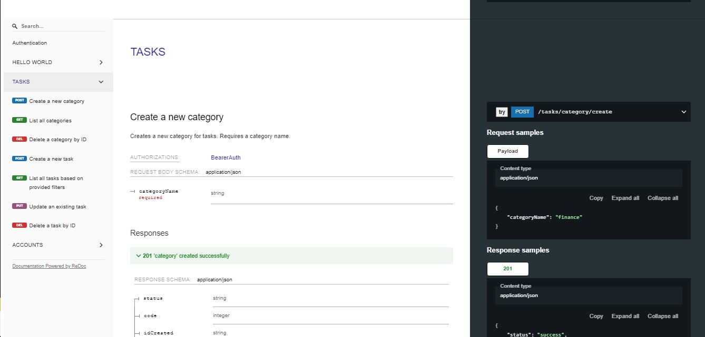

# Tasky Tracer

Tasky Tracer is a secure API for managing tasks, featuring user authentication with JWT, and full CRUD operations for creating, updating, and deleting to-do items. With options for task prioritization, filtering, and collaboration, it simplifies task management for both individuals and teams, enhancing productivity in a user-friendly manner.

## Technologies and Features

- **TypeScript**: Provides strong typing and enhanced developer experience.
- **API Gateway (NGINX)**: Acts as a reverse proxy for routing requests to microservices.
- **Microservices**: A modular architecture that breaks down the application into smaller, independent services.
- **Node.js**: The runtime environment for building scalable and high-performance server-side applications.
- **Express**: Web framework for building the API endpoints.
- **Postgres**: Relational database management system for storing task data.
- **TypeORM**: ORM for interacting with the Postgres database in a type-safe manner.
- **Logs**: Centralized logging for monitoring and debugging.
- **Error Handler**: A robust error handling system to ensure reliability and proper user feedback.
- **Documentation (Swagger & Redocly)**: Automatically generated API documentation for ease of use and integration.
- **Rate Limiter (DDOS protection)**: Mitigates potential DDOS attacks by limiting the number of requests.
- **Inputs Validation (ZOD & Lodash)**: Ensures data integrity and prevents invalid inputs with ZOD and Lodash libraries.
- **Docker**: Containerization for consistent deployment and easy scalability.
- **Internationalization (Server-side Translation)**: Supports multiple languages to cater to a global user base.
- **Account Management Service**: A service for managing user accounts, roles, and permissions.
- **JWT Authentication & Refresh Token**: Secure authentication system with JSON Web Tokens and Refresh Tokens for session management.





## Features

- User Authentication with JWT and Refresh Tokens
- Full CRUD operations for task management
- Task prioritization and filtering
- Collaboration features for team task management
- Rate Limiting to prevent DDoS attacks
- Input Validation with ZOD and Lodash
- Secure API Gateway (NGINX)
- Internationalization support for multiple languages
- Dockerized for easy deployment

## Installation

To run the Tasky Tracer API locally, follow these steps:

1. Clone the repository:

```bash
git clone https://github.com/juliokozarewicz/taskytracer.git
```

2. Install dependencies:
```bash
cd taskytracer
npm install
```

3. Set up environment variables for hosts, email, database and JWT configuration.

4. Access the API documentation via Swagger at http://localhost:3000/documentation/swagger or Redocly http://localhost:3000/documentation/redocly